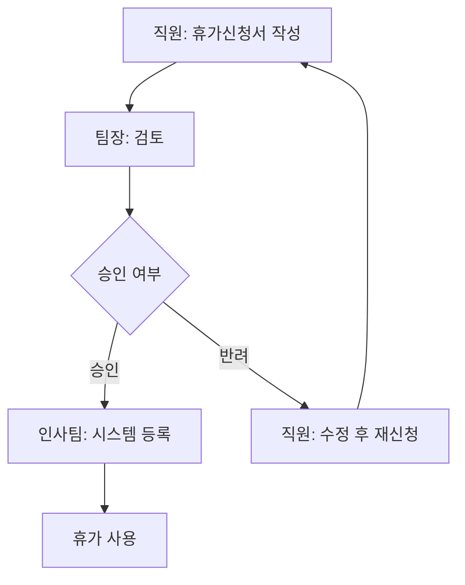
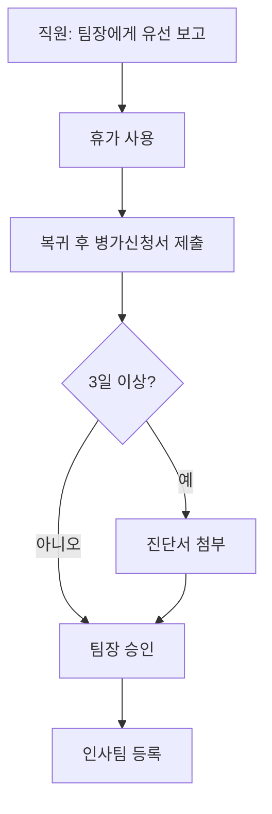
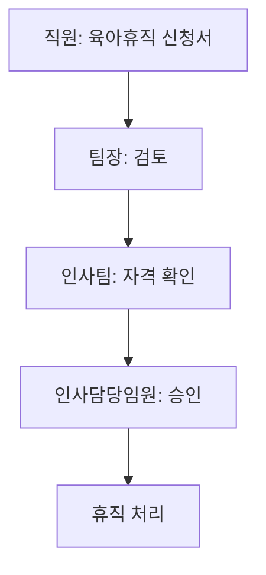
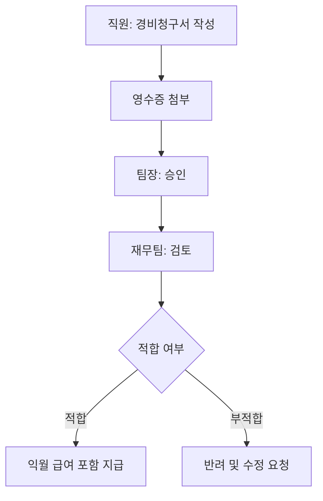
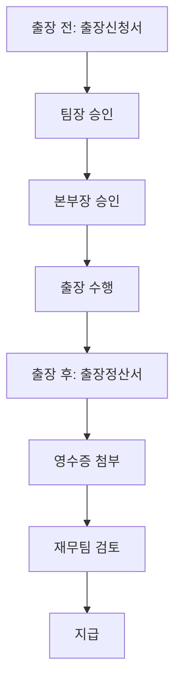

# 결재 워크플로우 가이드

## 개요

본 문서는 회사 내 주요 결재 프로세스와 권한 체계를 설명합니다.

---

## 1. 결재 권한 체계

### 1.1 금액별 결재 권한

| 금액 범위 | 결재권자 |
|:----------|:---------|
| 10만원 미만 | 팀장 |
| 10만원 ~ 100만원 | 팀장 + 본부장 |
| 100만원 ~ 500만원 | 팀장 + 본부장 + 담당임원 |
| 500만원 ~ 1,000만원 | 팀장 + 본부장 + 담당임원 + CFO |
| 1,000만원 이상 | 팀장 + 본부장 + 담당임원 + CFO + CEO |

### 1.2 결재 유형별 권한

#### 인사 관련
- **휴가 신청**: 팀장 승인
- **출장 신청**: 팀장 + 본부장 승인
- **부서 이동**: 현팀장 + 이동팀장 + 인사팀장 승인
- **퇴직 처리**: 팀장 + 인사담당임원 승인

#### 경비 관련
- **경비 청구**: 팀장 + 재무팀 검토
- **법인카드 발급**: 팀장 + 재무팀장 승인
- **예산 초과**: 본부장 + CFO 승인

---

## 2. 휴가 결재 프로세스

### 2.1 연차휴가

**소요 시간**: 1-2일  
**필요 서류**: 휴가신청서

### 2.2 병가

**소요 시간**: 사후 처리  
**필요 서류**: 병가신청서, 진단서 (3일 이상 시)

### 2.3 육아휴직

**소요 시간**: 7-14일  
**필요 서류**: 육아휴직신청서, 출생증명서/가족관계증명서

---

## 3. 경비 결재 프로세스

### 3.1 일반 경비

**소요 시간**: 영업일 기준 3-5일  
**지급 시점**: 익월 급여일

### 3.2 출장비

**출장비 기준**:
- 국내 일비: 30,000원/일
- 해외 일비: 지역별 상이 (미국 $100, 동남아 $70 등)

---

## 4. 긴급 결재

### 4.1 정의

긴급 결재는 다음 상황에서 적용됩니다:
- 결재권자 부재 시 업무 지연이 심각한 경우
- 긴급한 사업적 필요가 있는 경우
- 고객 대응 등 시급한 처리가 필요한 경우

### 4.2 절차

1. **사유서 작성**: 긴급 결재 사유 명시
2. **유선 보고**: 직상위 결재권자에게 구두 보고
3. **대결 승인**: 결재권자 부재 시 차상위자 결재
4. **사후 결재**: 결재권자 복귀 후 사후 승인

### 4.3 주의사항

- 긴급 결재 남용 시 경고 조치
- 사후 결재는 3일 이내 완료
- 금액 500만원 이상은 긴급 결재 불가

---

## 5. 결재 반려 사유

| 반려 사유 | 설명 | 대응 방법 |
|:----------|:-----|:----------|
| 서류 미비 | 필수 첨부 서류 누락 | 서류 보완 후 재신청 |
| 예산 초과 | 팀/부서 예산 초과 | 예산 조정 또는 내년 이월 |
| 정책 위반 | 회사 규정 위배 | 사유 검토 후 예외 승인 요청 |
| 중복 신청 | 동일 건 중복 | 기존 신청 확인 후 취소 |

---

## 6. 문의처

| 결재 유형 | 담당 부서 | 연락처 |
|:----------|:----------|:-------|
| 휴가/인사 | 인사팀 | hr@company.com |
| 경비/지급 | 재무팀 | finance@company.com |
| 시스템 오류 | IT팀 | it@company.com |

---

*최종 수정: 2024년 6월*  
*문서 번호: HR-WF-001*
